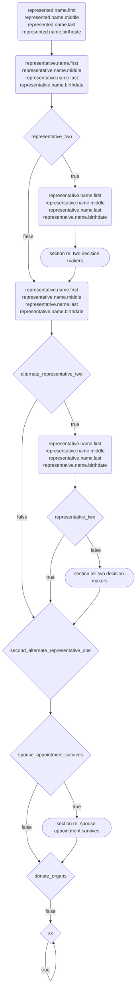

```mermaid
graph TD

    1(represented.name.first<br/>represented.name.middle<br/>represented.name.last<br/>represented.name.birthdate) -->

    2(representative.name.first<br/>representative.name.middle<br/>representative.name.last<br/>representative.name.birthdate) -->

    3{representative_two} --false--> 4
    3 --true--> 3.1

    3.1(representative.name.first<br/>representative.name.middle<br/>representative.name.last<br/>representative.name.birthdate) --> 3.2

    3.2([section re: two decision makers]) --> 4

    4(representative.name.first<br/>representative.name.middle<br/>representative.name.last<br/>representative.name.birthdate) -->

    5{alternate_representative_two} --false--> 6
    5 --true--> 5.1

    5.1(representative.name.first<br/>representative.name.middle<br/>representative.name.last<br/>representative.name.birthdate) --> 5.2

    5.2{representative_two} --false--> 5.3
    5.2 --true--> 6

    5.3([section re: two decision makers]) --> 6

    6{second_alternate_representative_one} --> 7

    7{spouse_appointment_survives} --false--> 8
    7 --true--> 7.1

    7.1([section re: spouse appointment survives]) --> 8

    8{donate_organs} --false--> 9
    --true-->

    9{xx}
```
